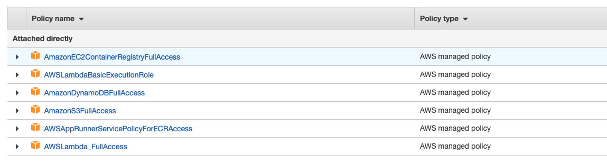
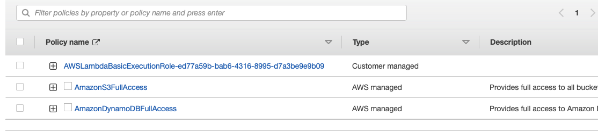

# serverless_pipelines_using_lambda

## Resources
1. [DynamoDB Resource](https://highlandsolutions.com/blog/hands-on-examples-for-working-with-dynamodb-boto3-and-python)
2. [AWS_Documentation_for_ECR_Python](https://docs.aws.amazon.com/lambda/latest/dg/python-image.html)

## Requirements
1. Create User with the access to Dynamodb, S3, lambda, ECR

2. Provide the following permission for lambda role

